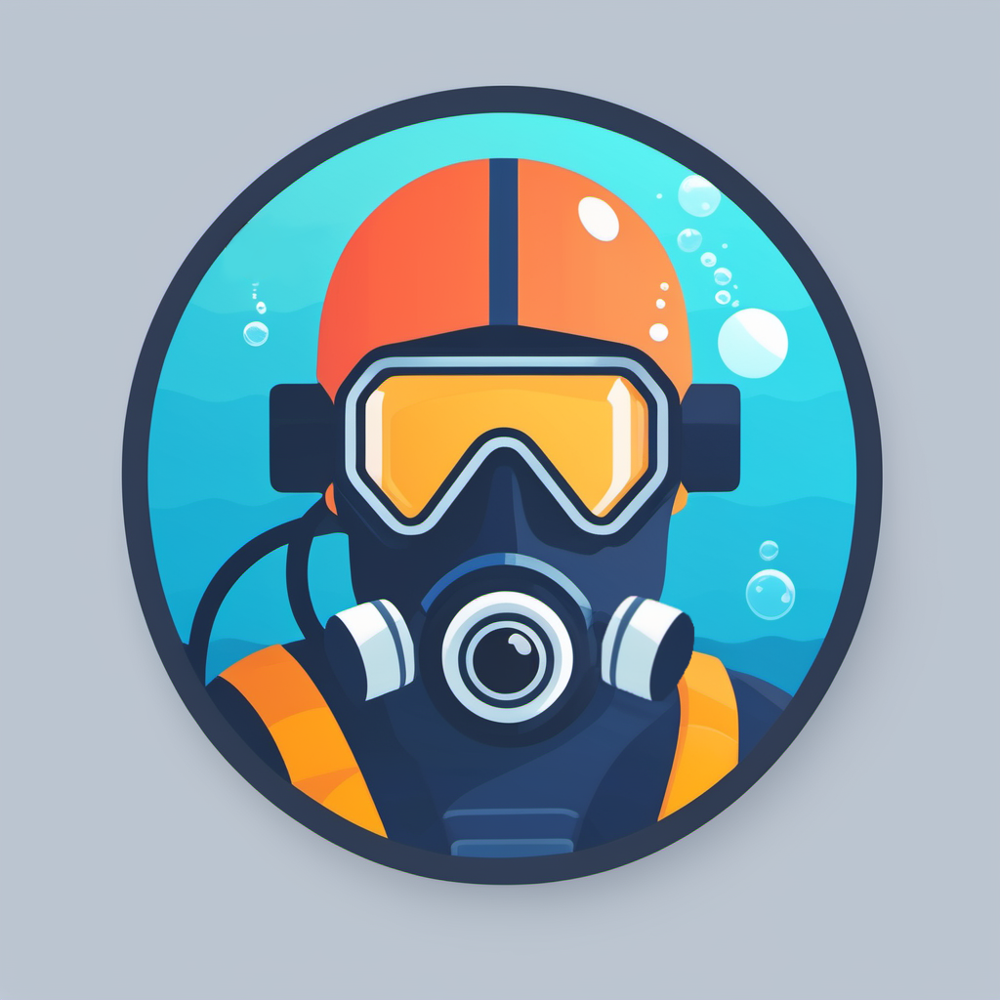

# Dive Log
This repository contains code for a dive log Android app that can import dives from
[hwOS](https://heinrichsweikamp.com/hw-os) family of dive computers (e.g. Heinrichs Weikamp OSTC Sport) via Bluetooth
LE (BLE).

## Features

MVP:
- Offline-first dive log
- Fetch and merge dive logs from dive computer
- Plot of dive profile
- Add and edit notes

Tech:
- [Jetpack Compose](https://developer.android.com/jetpack/compose)
- [Material 3 Dynamic Color Support](https://m3.material.io/styles/color/dynamic-color/overview) 
- CI/CD via [GitHub Actions](https://github.com/features/actions)

Next steps:
- Map of dive spots
- Synchronize dive logs in external cloud (e.g. Google Drive)
- CSV export / import
- Additional data (equipment, observations, tags, images)
- Support for more dive computers

## Modules
- `app`: The UI layer. Contains compose views, viewmodels, resources, etc.
- `data`: The data layer. Contains business logic components, e.g. `DiveRepository`.
- `bluetooth`: Generic bluetooth connectivity, permission and pairing handling. No domain specific code.
- `persistence`: Local SQLite database.

## Bluetooth Import

### Bluetooth LE
Bluetooth LE endpoints are called characteristics (e.g. "firmware revision" or "battery level"). They are grouped into
services (e.g. "device information"). Characteristics and services are identified by UUIDs. Characteristics can allow:
- Reading
- Writing (with or without response, like TCP/UDP)
- Notifications/Indications (app gets notified by device if a value changed, with our without acknowledgement)

A hwOS device has these endpoints:
- Service: Generic Access (`0x1800`)
    - Characteristic: Device Name (`0x2A00`, `READ`) &rarr; "OSTCs 21876"
    - Characteristic: Appearance (`0x2A01`, `READ`)
- Service: Generic Attribute (`0x1801`)
- Service: Device Information (`0x180A`)
    - Characteristic: PnP ID Name (`0x2A50`, `READ`)
- Service: Terminal IO (`0xFEFB`)
    - Characteristic: UART Data RX (`00000001-0000-1000-8000-008025000000`, `WRITE - NO RESPONSE`)
    - Characteristic: UART Data TX (`00000002-0000-1000-8000-008025000000`, `NOTIFY`)
    - Characteristic: UART Credits RX (`00000003-0000-1000-8000-008025000000`, `WRITE`)
    - Characteristic: UART Credits TX (`00000004-0000-1000-8000-008025000000`, `INDICATE`)

### Communication Workflow
See [Terminal I/O Profile Client Implementation Guide](http://www.iot.com.tr/uploads/pdf/TIO_Implementation_Guide_r05.pdf).

hwOS does not use Bluetooth LE characteristics directly as endpoints for fetching dives. Instead communication is done
through a **simulated virtual serial COM port** over four specific BLE characteristics. This is based on the
"Terminal I/O v2.0 protocol" by Telit Wireless Solutions (formerly Stollmann E+V GmbH).

1. App connects to (previously bonded) BLE device
2. App sets up indication to Credits TX
3. App sets up notification to Data TX
4. App sends credits (e.g. `0xFE` as UInt8 for 254 credits) via Credits RX
5. Device sends credits to app via Credits TX
6. App can now:
    - Send commands via Data RX
    - Receive responses via Data TX

### Package Format
See [hwOS API specification](https://code.heinrichsweikamp.com/public/hwos_code/raw-file/tip/doc/hwos_interface.pdf).

Requests:
- Byte 0: Command ID
- Byte 1...n: Payload (variable length payloads like strings are `0x00` terminated)

Responses:
- Byte 0: Command ID (echo)
- Byte 1...(n-1): Payload
- Byte n: `0x4D`

### Download Dives
See [OstcConnection.kt](./data/src/main/kotlin/cloud/mike/divelog/data/importer/ostc/OstcConnection.kt) for
implementation details.

First off we have to enable download mode by sending the "start communication" command (`0xBB`). Afterwards we can end
communication by sending the "exit communication" command (`0xFF`). This will kill the bluetooth connection.

We have three options:
- Send "get compact headers" command (`0x6D`):
    - Device will always send all 256 dive headers (4096 bytes total)
    - Unused headers consist of `0xFF` and must be filtered
    - Includes date, duration, max depth and dive number
- Send "get full headers" command (`0x61`):
    - 65536 bytes total
    - Includes more information than compact headers, like surface pressure, min. temperature, gas mix, deco model, etc.
- Send "get dive profile" command (`0x66`) with dive number (0-255).
    - Sends full header and dive profile)
    - Profile has variable length, e.g. ~21 kB for a one-hour dive
    - Profile contains depth and events like gas mix change

## Links
- [Mike's Android Bluetooth Guide](https://mike.cloud/android/2021/05/19/bluetooth.html)
- [hwOS source](https://code.heinrichsweikamp.com/public/hwos_code/file/tip)
- [Lovely rant about BLE serial communication](https://github.com/subsurface/subsurface/blob/e91c252093e2e12488ae576bf38dbf8859efabea/core/qt-ble.cpp#L121-L135) by [@torvalds](https://github.com/torvalds)
