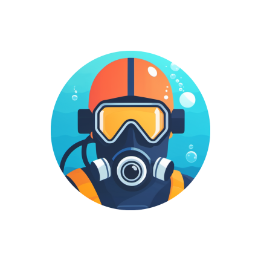
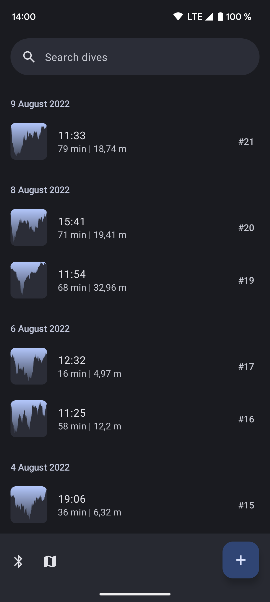
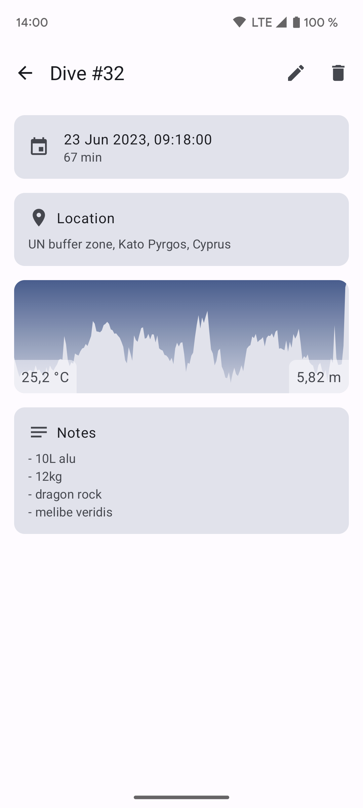

# Dive Log

&nbsp;

An offline-first Android dive log app with support for importing data from dive computers via Bluetooth LE.

This project uses:
- [Jetpack Compose](https://developer.android.com/jetpack/compose)
- [Material 3 dynamic colors](https://m3.material.io/styles/color/dynamic-color/overview)
- [Recommended Android Architecture](https://developer.android.com/topic/architecture/recommendations)
- [GitHub Actions](https://github.com/features/actions)

Supported dive computers:
- [OSTC](./docs/OSTC.md)
- [Shearwater Perdix](./docs/Shearwater.md)

## Modules
- `app`: The UI layer with compose views, viewmodels, resources, etc.
- `data`: The data layer with business logic components (e.g. `DiveRepository`).
- `bluetooth`: Generic bluetooth connectivity, permission and pairing handling. No domain specific code.
- `persistence`: Local SQLite database.

## Links
- [Mike's Android Bluetooth Guide](https://mike.cloud/android/2021/05/19/bluetooth.html)
- [Libdivecomputer](https://github.com/libdivecomputer/libdivecomputer)
- [Lovely rant about BLE serial communication](https://github.com/subsurface/subsurface/blob/e91c252093e2e12488ae576bf38dbf8859efabea/core/qt-ble.cpp#L121-L135) by [@torvalds](https://github.com/torvalds)
